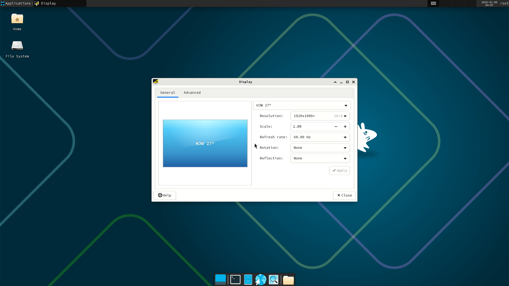

# Arch Linux LPi4A Test Report

## Test Environment

### System Information

- Download link: https://mirror.iscas.ac.cn/archriscv/images/
- u-boot and boot downloads (using revyos): https://mirror.iscas.ac.cn/revyos/extra/images/lpi4a/

### Hardware Information

- Lichee Pi 4A (16GB RAM + 128GB eMMC)
- A USB Power Adapter
- A USB-A to C or C to C Cable
- A USB to UART Debugger (e.g., CH340, CH341, FT2232, etc.)
- Three Dupont Wires


## Installation Steps

### Create rootfs

Since Arch Linux does not provide pre-packaged images but a rootfs, we need to create the image ourselves.

- Create a block device and file system
```bash
sudo dd if=/dev/zero of=rootfs.ext4 bs=1M count=6144 # Create a 6GB rootfs
sudo mkfs.ext4 rootfs.ext4
mkdir mnt
sudo mount ./rootfs.ext4 ./mnt
```

- Extract rootfs into the root directory
```bash
sudo tar -I zstd -xvf archriscv-2024-09-22.tar.zst -C mnt/
```

- Obtain the UUID of the file system
```bash
lsblk -o NAME,UUID
```

- Perform necessary updates, package installation, and adjustments in rootfs
```bash
sudo systemd-nspawn -D ./mnt --machine=archriscv

# The following commands are executed inside rootfs
pacman -Syu
# Install necessary packages such as vim here.
echo "UUID=<UUID> /  ext4  defaults  1  1 " >> /etc/fstab # Use the <UUID> obtained earlier
passwd # Set your root password!
exit
```

- Unmount rootfs
```bash
sudo umount ./mnt
```

### Flashing Bootloader

Extract the installation suite.
Flash u-boot and boot.

*Select whether you need 8GB version u-boot according to your hardware version*

```bash
zstd -d boot-lpi4a-20250110_151339.ext4.zst 
sudo fastboot flash ram u-boot-with-spl-lpi4a-16g-main.bin 
sudo fastboot reboot
sudo fastboot flash uboot u-boot-with-spl-lpi4a-16g-main.bin
sudo fastboot flash boot boot-lpi4a-20250110_151339.ext4
```

### Flashing Image

Flash the root partition into eMMC.

```bash
sudo fastboot flash root rootfs.ext4
```

### Logging into the System

Access the system via serial port.

Default username: `root`
Default password: the password you set earlier or use default `archriscv`.

### Install Desktop Environment

Take the example of installing xfce:

```
pacman -S xorg xfce4 ligthdm lightdm-gtk-greeter
systemctl enable --now ligthdm
```

## Expected Results

The system boots up successfully, allowing login via onboard serial port.

## Actual Results

The system boots up successfully, and login via onboard serial port is successful.

### Boot Log



Screen recording (from creating rootfs to logging into the system):
[](https://asciinema.org/a/7Ywwvlg1kdyAyTa9hiUOnv4yN)

```log
Arch Linux 6.6.66-th1520 (ttyS0)

archlinux login: root
Password: 
Last login: Thu Jan  9 03:54:09 on ttyS0
[root@archlinux ~]# uname -a
Linux archlinux 6.6.66-th1520 #2025.01.10.02.53+1c6721ec2 SMP Fri Jan 10 03:09:24 UTC 2025 riscv64 GNU/Linux
[root@archlinux ~]# cat /etc/os-release 
NAME="Arch Linux"
PRETTY_NAME="Arch Linux"
ID=arch
BUILD_ID=rolling
ANSI_COLOR="38;2;23;147;209"
HOME_URL="https://archlinux.org/"
DOCUMENTATION_URL="https://wiki.archlinux.org/"
SUPPORT_URL="https://bbs.archlinux.org/"
BUG_REPORT_URL="https://gitlab.archlinux.org/groups/archlinux/-/issues"
PRIVACY_POLICY_URL="https://terms.archlinux.org/docs/privacy-policy/"
LOGO=archlinux-logo
[root@archlinux ~]# cat /proc/cpuinfo 
processor       : 0
hart            : 0
isa             : rv64imafdc_zicntr_zicsr_zifencei_zihpm_xtheadvector
mmu             : sv39
uarch           : thead,c910
mvendorid       : 0x5b7
marchid         : 0x0
mimpid          : 0x0

processor       : 1
hart            : 1
isa             : rv64imafdc_zicntr_zicsr_zifencei_zihpm_xtheadvector
mmu             : sv39
uarch           : thead,c910
mvendorid       : 0x5b7
marchid         : 0x0
mimpid          : 0x0

processor       : 2
hart            : 2
isa             : rv64imafdc_zicntr_zicsr_zifencei_zihpm_xtheadvector
mmu             : sv39
uarch           : thead,c910
mvendorid       : 0x5b7
marchid         : 0x0
mimpid          : 0x0

processor       : 3
hart            : 3
isa             : rv64imafdc_zicntr_zicsr_zifencei_zihpm_xtheadvector
mmu             : sv39
uarch           : thead,c910
mvendorid       : 0x5b7
marchid         : 0x0
mimpid          : 0x0
[root@archlinux ~]# fastfetch 
                  -`                     root@archlinux
                 .o+`                    --------------
                `ooo/                    OS: Arch Linux riscv64
               `+oooo:                   Host: Sipeed Lichee Pi 4A 16G
              `+oooooo:                  Kernel: Linux 6.6.66-th1520
              -+oooooo+:                 Uptime: 12 mins
            `/:-:++oooo+:                Packages: 131 (pacman)
           `/++++/+++++++:               Shell: bash 5.2.37
          `/++++++++++++++:              Terminal: vt220
         `/+++ooooooooooooo/`            CPU: thead,c910 rv64gc (4) @ 1.85 GHz
        ./ooosssso++osssssso+`           Memory: 232.95 MiB / 15.44 GiB (1%)
       .oossssso-````/ossssss+`          Swap: 0 B / 4.00 GiB (0%)
      -osssssso.      :ssssssso.         Disk (/): 999.02 MiB / 5.82 GiB (17%) - ext4
     :osssssss/        osssso+++.        Locale: C.UTF-8
    /ossssssss/        +ssssooo/-
  `/ossssso+/:-        -:/+osssso+-                              
 `+sso+:-`                 `.-/+oso:                             
`++:.                           `-/+/
.`                                 `/
```

## Test Criteria

Successful: The actual result matches the expected result.

Failed: The actual result does not match the expected result.

## Test Conclusion

Test successful.
