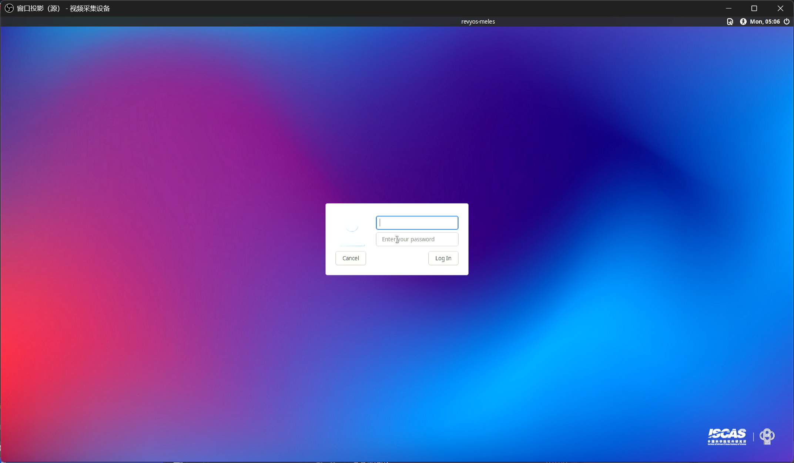
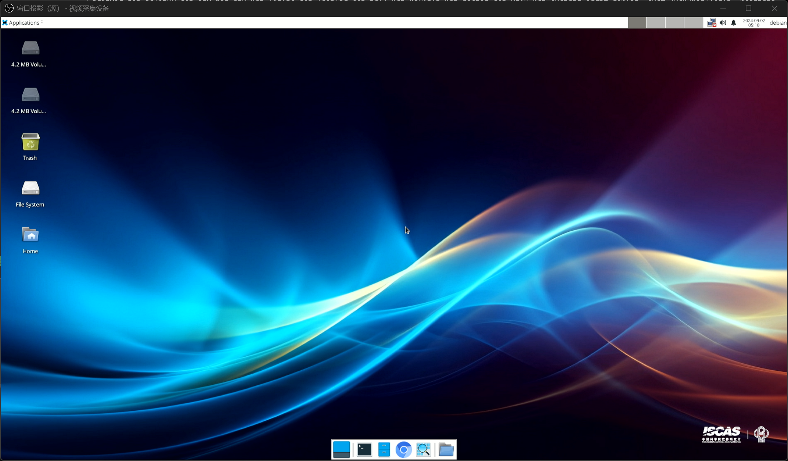

# RevyOS Meles Version Test Report

## Test Environment

### Operating System Information

- System Version: RevyOS Meles 20241229
- Download Link: https://mirror.iscas.ac.cn/revyos/extra/images/meles/20241229/
    - iw-single-line binary: https://mirror.iscas.ac.cn/revyos/extra/images/meles/20240720/iw-single-line.bin
- Reference Installation Document: https://milkv.io/zh/docs/meles/getting-started/boot

### Hardware Information

- Milk-V Meles 4GB/8GB/16GB
- eMMC module > 16GB
- A USB A to C cable
- Optional: A USB-TTL Debugger (Flash U-Boot with SPL to SPI NOR Flash)
- Optional: Keyboard, monitor, mouse (for graphical interface testing)

## Installation Steps

Milk-V Meles' Bootloader is stored inside the onboard SPI NOR Flash, which can be upgraded using `cct` tool provided by `yoctools`. This is different from Lichee Pi 4A which uses the same TH1520 SoC.

You'll need UART serial connection to flash the firmware.

> Note: please do not try to use `fastboot flash uboot` method to upgrade U-Boot firmware, which is the same as the LPi4A.
> This method will NOT flash U-Boot to SPI NOR Flash which is loaded on boot by default. Thus you must use `cct` to flash the firmware.

Known issue: some AMD boards might not pick up Meles in fastboot mode.

Workaround: try connect Meles to a external USB Hub rather than the USB ports directly provided by the motherboard/PCH.

### Use `cct` to flash Bootloader into SPI NOR Flash

`cct` is the image flashing tool provided by `yoctools`, which requires Python 3.6~3.11 and Linux.

If your distro has already upgrade to Python 3.12+, then you'll need to manually install Python 3.11, create a Python virtual environment with it.

Since Python 3.12 and [PEP 668](https://peps.python.org/pep-0668/), you can not use `pip` to install packages globally.

And `yoctools` still depends on some packages which were already deprecated/replaced in Python 3.12+, thus you must create a Python venv in order to use `yoctools`.

Take Arch Linux as an example. By the time this article was written (2025.01), the default Python is Python 3.13, directly install `yoctools` will not work. You should install Python 3.11 from [AUR](https://aur.archlinux.org/packages/python311/) and creating a virtual environment using this version in order to flash the firmware.

Prepare Python 3.11 environment:

```shell
paru python311
sudo pacman -S python-virtualenv
virtualenv -p 3.11 meles
source meles/bin/activate
pip install yoctools
cd meles/bin
```

For those distros still staying at Python 3.6~3.11, you can install `yoctools` directly with `pip`. Python venv is not required.

Download the firmware:

```shell
wget https://mirror.iscas.ac.cn/revyos/extra/images/meles/20240720/iw-single-line.bin
wget https://mirror.iscas.ac.cn/revyos/extra/images/meles/20241229/u-boot-with-spl-meles.bin
```

Note: choose the correct version depending on your board's RAM:

- 4GB -> u-boot-with-spl-meles-4g.bin
- 8GB -> u-boot-with-spl-meles.bin
- 16GB -> u-boot-with-spl-meles-16g.bin

For `iw-single-line.bin`, you can use it with all RAM versions.

Connect the board and your PC with UART debugger. **DO NOT** run tools like `minicom` or `tio` which will occupy the serial port.

Hold the recovery button and **THEN** power on the board.

> The recovery button is located at the edge of the board near the GPIO pins, on the inner side it's the eMMC boot button. Don't mixed them.
> For details please refer to: https://milkv.io/docs/meles/hardware/meles-main-board

```shell
sudo ./cct list -u /dev/ttyUSB0
#Please change accordingly. Depending on your debugger, e.g. for CH343P it's ttyACM0 rather than ttyUSB0
sudo ./cct download -d ram0 -f iw-single-line.bin -v checksum -r
sudo ./cct download -u /dev/ttyUSB0 -d qspi0 -f ./u-boot-with-spl-meles.bin -v checksum -r -t 1200
```

Wait for the flashing progress to complete, then power off the board, hold the recovery button and reconnect it to PC.

### Flashing Image using `fastboot` onto the Development Board

Check connection status:

```shell
$ lsusb | grep T-HEAD
Bus 001 Device 045: ID 2345:7654 T-HEAD USB download gadget
```

Next, execute the following commands to download, extract and flash the images to your board's eMMC.

> If `fastboot` doesn't pick up the board or you encounter flashing issues, check the device connection and try running `fastboot` as a privileged user (i.e. `sudo`). Doing so is usually required under Linux since the default USB VID/PID is not in the default udev rules.

```shell
wget https://mirror.iscas.ac.cn/revyos/extra/images/meles/20241229/boot-meles-20241229_032258.ext4.zst
wget https://mirror.iscas.ac.cn/revyos/extra/images/meles/20241229/root-meles-20241229_032258.ext4.zst
zstd -T0 -dv *.ext4.zst
sudo fastboot flash ram u-boot-with-spl-meles.bin
sudo fastboot reboot
sudo fastboot flash boot boot-meles-20241229_032258.ext4
sudo fastboot flash root root-meles-20241229_032258.ext4
```

After the flashing process, reset the board and you're good to go.

Better do a system upgrade via `sudo apt update; sudo apt upgrade` after flashing. There's a kernel upgrade which fixed some known issues (e.g. the onboard Wi-Fi might not work)

### Logging into the System

Logging into the system via serial port or graphical interface.

Default Username: `debian`
Default Password: `debian`

## Expected Results

The system should boot up normally and allow login through the serial port.

HDMI output works and the user can login to the desktop environment.

## Actual Results

The actual results matches the expected results.

### Boot Log

[](https://asciinema.org/a/GowOSUJ7oFYVH4igmtqB0s4ub)





(The screenshots are from an HDMI capture card.)

## Test Criteria

Successful: The actual result matches the expected result.

Failed: The actual result does not match the expected result.

## Test Conclusion

Test successful.
